# webapp08
# Auction Application (PUJAHOY)
## Contributors
### Jorge Andrés Echevarría j.andres.2022@alumnos.urjc.es jae9104
### Arturo Enrique Gutierrez Mirandona ae.gutierrez.2022@alumnos.urjc.es arturox2500
### Iván Gutiérrez González i.gutierrez.2022@alumnos.urjc.es IvanGutierrrez
### Víctor Bartolomé Letosa v.bartolome.2022@alumnos.urjc.es victorino2324
### Miguel Pradillo Bartolomé	m.pradillo.2020@alumnos.urjc.es	MikePradiBart

# Index

1. **[Auction Application Entities](#auction-application-entities)**
   - [User Entity](#user-entity)
   - [Product Entity](#product-entity)
   - [Offer Entity](#offer-entity)
   - [Transaction Entity](#transaction-entity)
   - [Rating Entity](#rating-entity)

2. **[User Roles & Permissions](#user-roles--permissions)**
   - [Unregistered User](#unregistered-user)
   - [Registered User](#registered-user)
   - [Administrator](#administrator)

3. **[Images](#images)**

4. **[Charts](#charts)**

5. **[Complementary Technology](#complementary-technology)**

6. **[Advanced Algorithm or Query](#advanced-algorithm-or-query)**

7. **[Pages](#pages)**
   - [Featured Products (Index)](#featured-products-index)
   - [Sign-Up Page](#sign-up-page)
   - [Log-In Page](#log-in-page)
   - [Account Details Page](#account-details-page)
   - [Your Winning Bids](#your-winning-bids)
   - [Your Products](#your-products)
   - [Edit Profile](#edit-profile)
   - [New Auction Page](#new-auction-page)
   - [Product Page](#product-page)
   - [Navigation diagram](#navigation-diagram)

8. **[Instructions to Run](#instructions-to-run)**
   - [Required Technologies / Applications](#required-technologies--applications)
   - [Steps](#steps)
   - [Steps with Docker](#steps-with-docker)
   - [Steps for building Docker Image](#steps-for-building-docker-image)
   - [Steps with Virtual Machine](#steps-with-virtual-machine)
   - [Steps for execute Angular](#steps-for-execute-angular)

9. **[Documentation](#documentation)**
   - [Diagram with the database entities](#diagram-with-the-database-entities)
   - [Class and Templates Diagram Backend](#class-and-templates-diagram-backend)
   - [Class and Templates Diagram Frontend](#class-and-templates-diagram-frontend)
   - [Website demo video](#website-demo-video)

10. **[Contributors tag 1](#contributors-tag-1)**

11. **[Contributors tag 2](#contributors-tag-2)**

12. **[Contributors tag 3](#contributors-tag-3)**
    
    


## Auction Application Entities  

### User Entity  
The User entity represents a person registered in the auction application. It includes attributes such as ID, name, visible name, email, description, encoded password, profile picture, postal code, reputation, and active status.  

### Product Entity  
The Product entity represents an item listed for auction in the system. It includes attributes such as ID, name, description, initial value, seller ID, start time, end time, status, and image.  

### Offer Entity  
The offer entity represents a user's offer for a product in an auction. It includes attributes such as ID, cost, time, product ID, and user ID.  

### Transaction Entity  
The transaction entity represents the final transaction in which a user buys a product from a seller in an auction. It includes attributes such as ID, cost, buyer ID, product ID, and seller ID.  

### Rating Entity  
The rating entity represents the ratings given to sellers for their auctioned products. It includes attributes such as ID, score, product ID, and seller ID.  

---

## User Roles & Permissions  

### Unregistered User  
**Can:**
- Have access to auctions that are still ongoing.  
- View auctioned products.  
- Browse user profiles.  
- View a product's bidding history.  

### Registered User  
**Can:**
- Have access to auctions that are still ongoing.  
- Access their personal data.  
- View their listed products.  
- List products for auction.  
- Place bids on auctions.  
- Complete transactions as a buyer or seller.  
- View the products they have bid on and won.  
- Rate other users.  

### Administrator  
**Can:**  
- Have access to all listed products.  
- Ban or unban users and products.  

---

## Images  
- Users can upload images for the products they list.  
- Users may have their own profile picture.  

## Charts  
- Users can view line charts displaying the bidding history for each listed product.  

## Complementary Technology  
- The web application was supposed to use **Auth0** for authentication and authorization management. However, due to issues with the implementation it was decided to take the safer route and implement the map API that shows a postal code area.

## Advanced Algorithm or Query  
- When viewing listed products, they will be displayed in order based on the rating of the seller.  

---

## Pages  

### Featured Products (Index)  
All users, including unregistered ones, can browse available products. These products are displayed in order based on the ratings of the sellers. Users can navigate to individual product pages to view more details.
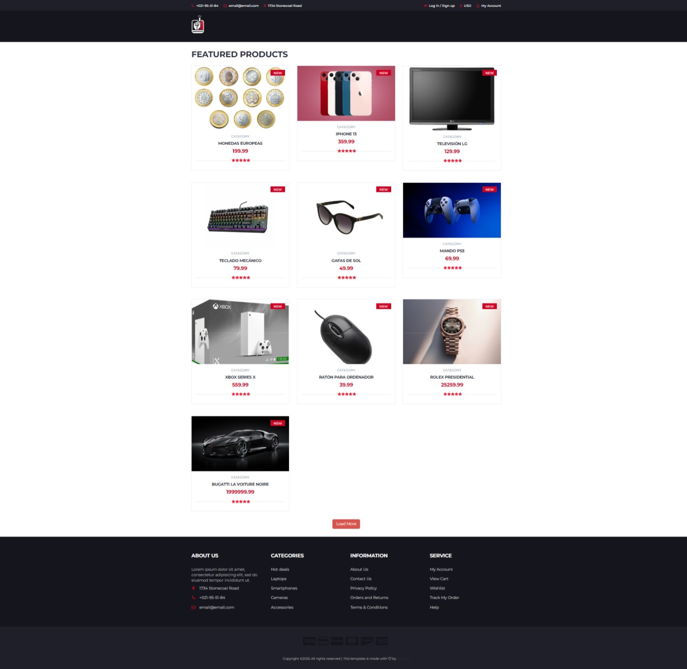

### Sign-Up Page  
Only available to unregistered users. This page allows them to provide the necessary information to create an account.
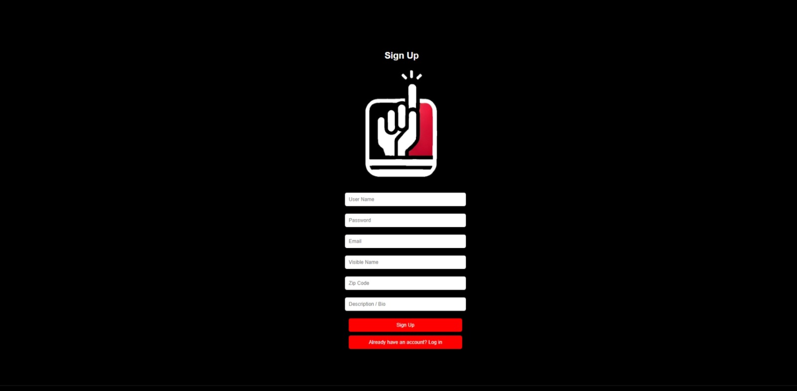

### Log-In Page  
Accessible to all users. It allows registered users to enter their credentials and access the application.
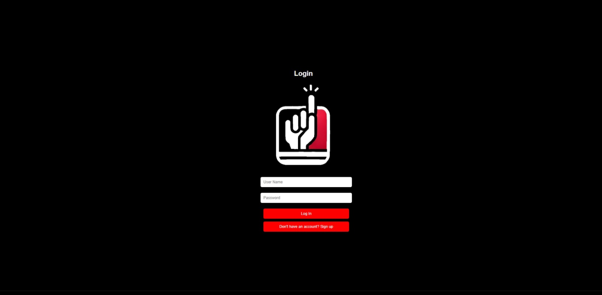

### Account Details Page  
Accessible to registered users. Users can:  
- Edit their profile information.  
- View a list of products they have posted.  
- Access a personal section displaying auctions where they have placed the highest bid.

When viewing another user's profile, these personal sections will not be visible.
When an Admin accesses another user's profile they can ban the user.


### Your Winning Bids  
This page is available to registered users. It displays a list of auctions where the user placed the highest bid, meaning they have won the item.
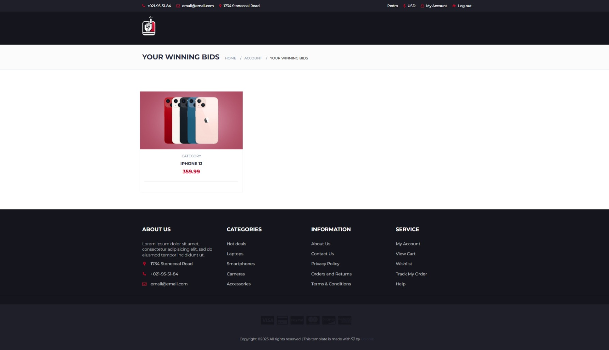

### Your Products  
Available to registered users. It shows a list of auctions created by the user, whether they are ongoing or finished.  
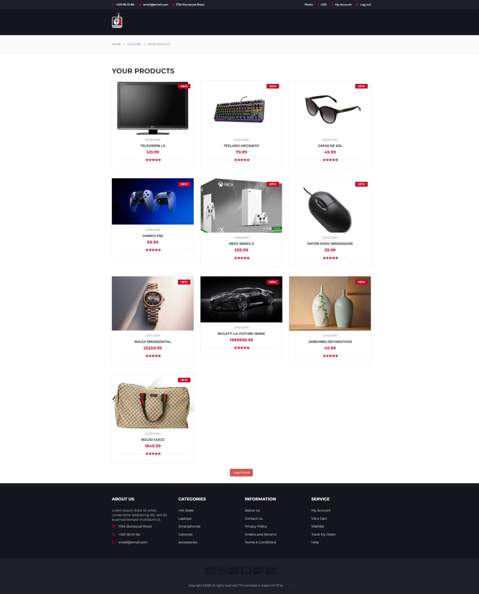

### Edit Profile  
Users can access this page to update their personal details such as their description/Bio, profile picture, and other relevant information. It is an extension to the regular Account Details Page 
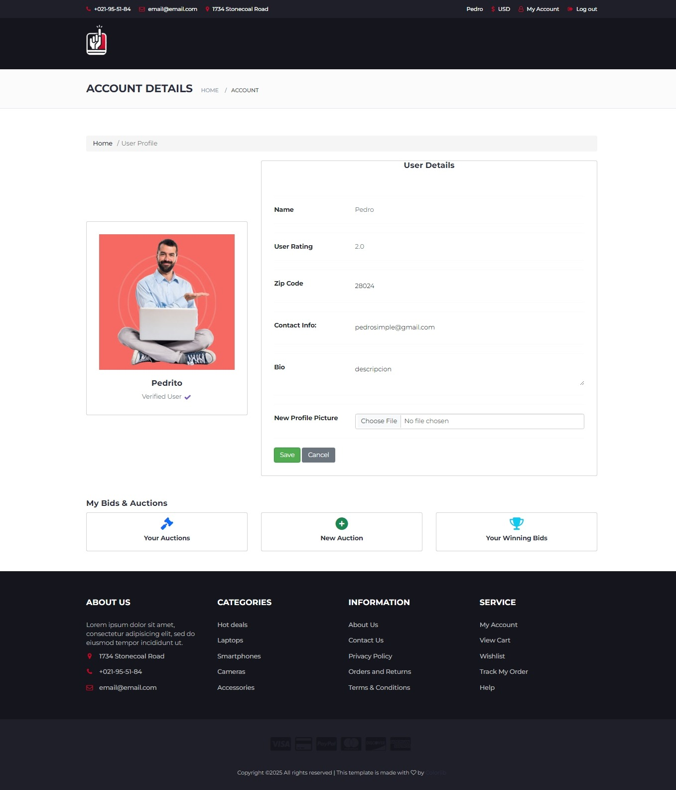

### New Auction Page  
Only available to registered users. This page allows them to create new product listings for auction.  
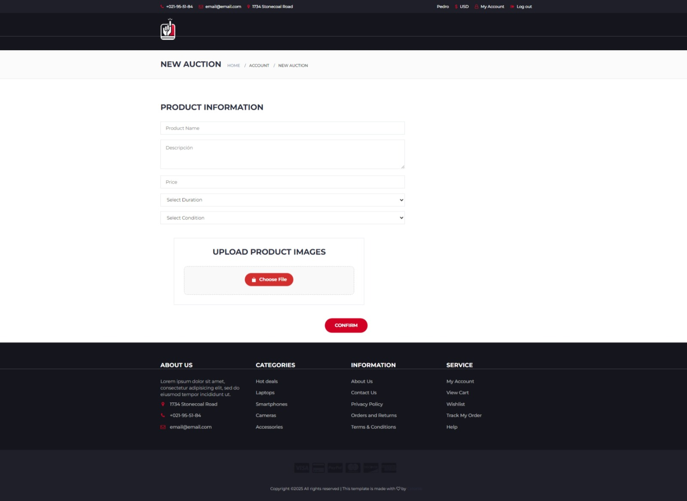


### Product Page  
All users can view:  
- The product's title, initial price, description, and current status (ongoing or finished).  
- The seller’s profile page.  
- A bidding history line chart.  
- An approximate location of the product using the postal code.

Registered users can place bids on the product.  
Admins have the ability to remove product listings to ensure compliance with platform rules.
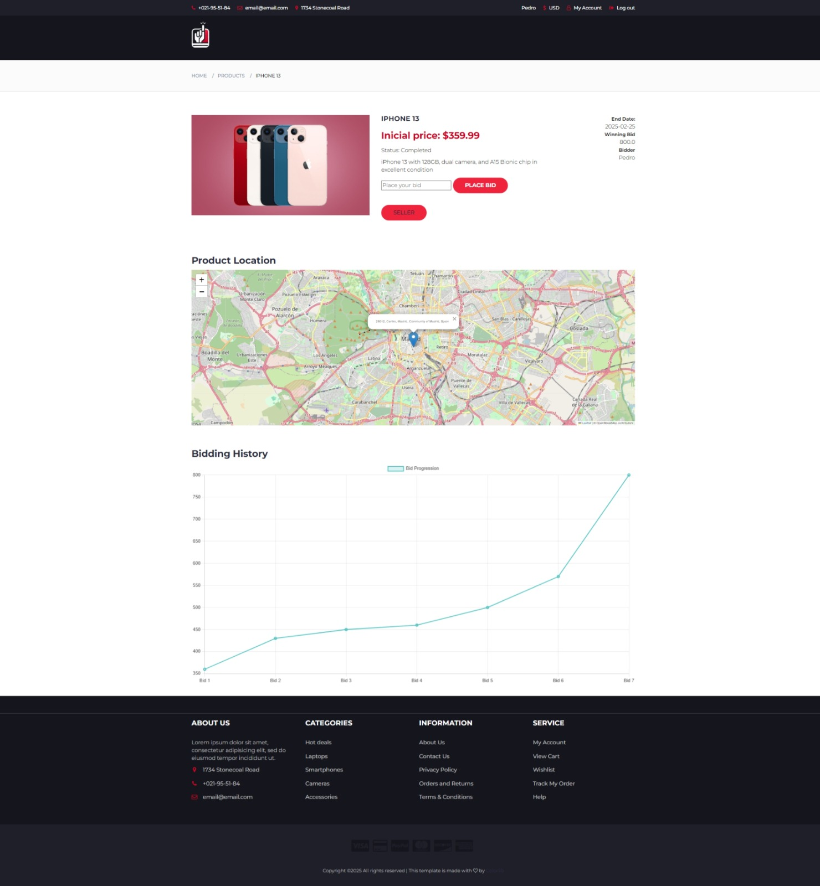

### Navigation diagram
As a summary we show the updated navigation diagram.

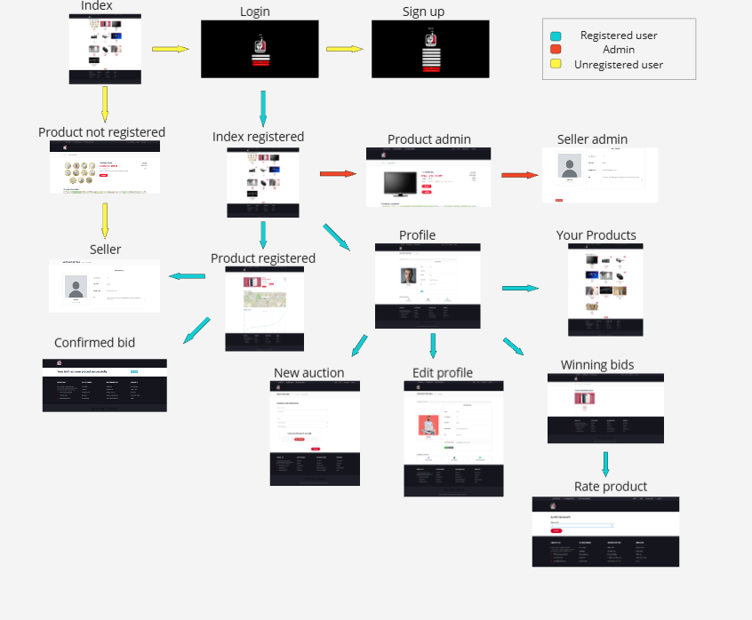

## Instructions to Run

### Required Technologies / Applications
- VSCode (or any preferred IDE like IntelliJ IDEA or Eclipse)
- Java 21
- Maven 4.0.0 or higher
- Spring Boot 3.4.3
- MySQL Installer 8.0.33 or higher
- MySQL Workbench 8.0.33 or higher
- Docker
- Docker Compose
- Angular Lenguage Service extensions (Available in VSCode)

### Steps
- Download the ZIP from this GitHub repository
- Extract it
- Run it with your IDE
- Configure the MySQL database with the password Password0] (specified in application.properties)
- Run the application
- Open your browser
- Go to
```bash
https://localhost:8443
```
- If you encounter security warnings, select Advanced options and then Proceed to the website

### Steps with Docker
- Install Docker 
- Install Docker Compose
- Run Docker
- Clone or download the repository
- Go to "backend" folder
- Execute Pujahoy with Docker Compose: "docker compose up"
- Open your browser
- Go to
```bash
https://localhost:8443
```
- If you encounter security warnings, select Advanced options and then Proceed to the website

### Steps for building Docker Image
-  Install Docker
-  Run Docker
-  Clone or download the repository
-  Go to "backend" folder
-  Execute:
```bash
chmod +x create_image.sh && ./create_image.sh
```
```bash
chmod +x publish_image.sh && ./publish_image.sh
```
- (NOTE:There's a chance you might encounter an unauthorized error. If this happens, run the "docker login" command and follow the process to log in, as Docker has rate limits for anonymous users. After logging in, simply rerun the above code.)

### Steps with Virtual Machine
It is required to be connected to URJC network to be able to access VM

- Open terminal
- Execute:
```bash
ssh -i ssh-keys/appWeb08.key vmuser@10.100.139.202
```
or
```bash
ssh -i ssh-keys/appWeb08.key vmuser@appWeb08.dawgis.etsii.urjc.es
```
- Clone or download the repository
- Go to "backend" folder
- Build the app with:
Docker compose up
- GO to
```bash
https://10.100.139.202:443
```
- Ultimately dont forget to execute this command after finished using to save energy :) :
Docker compose down

### Steps for execute Angular
Follow the nexts commands:

```bash
cd ./frontend
npm install -g @angular/cli@17.3.14
npm install
ng serve
```

And go to this URL in your browser
```bash
localhost:4200
````

## Documentation

### Diagram with the database entities
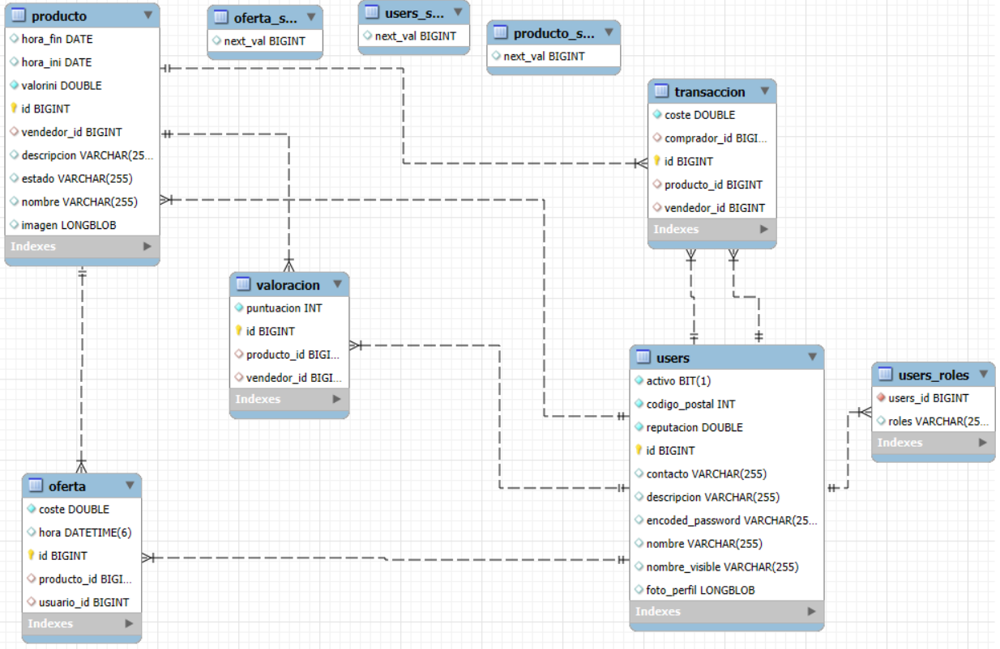

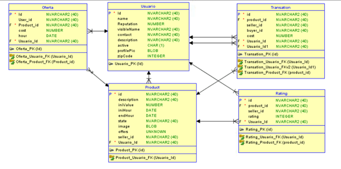


### Class and Templates Diagram Backend


### Class and Templates Diagram Frontend
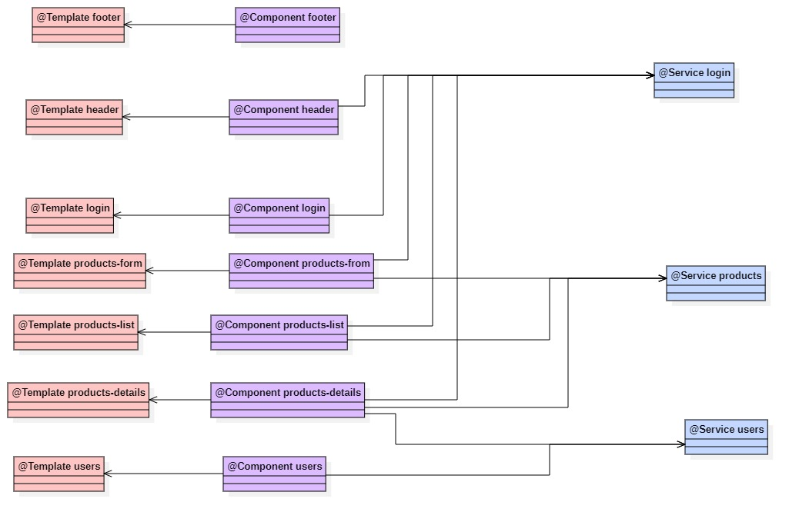

### Website demo video
[Link to youtube](https://youtu.be/mZCYIwExsls?si=cbz9QYbE-jWg9PXT)

## Contributors tag 1

### Jorge Andrés Echevarría

| Commit | Description |
| :----: | :---------: |
| [1º](https://github.com/CodeURJC-DAW-2024-25/webapp08/commit/fbe449fd97f234ce21aed70ca6b6b1a94b3f74d3) | In this commit full functionality of edit profile was added. Specifically to try new things, the form that sends the data to be replaced in the DB is created dynamically with JS.
| [2º](https://github.com/CodeURJC-DAW-2024-25/webapp08/commit/c0290a3c986e9232818a6ef3c1b77c4c7b1fa86f) | In this commit functionality for register was finished. Backend checks for certain details when registering such as Postal Code. Further checks to these fields were added on commit 1º   |
| [3º](https://github.com/CodeURJC-DAW-2024-25/webapp08/commit/8602f1bc7076d6e5a32ab3d52b2b2e2103c9b836) | In this commit functionality for the Map that locates a seller was implemented. Notice no GoogleMaps was used since a bank account was needed. So we decided to take the free approach. How it works is: Map is loaded with OpenStreetMap (Leaflet.js), the location is obtained with an API, then location is used to pin point in the map|
| [4º](https://github.com/CodeURJC-DAW-2024-25/webapp08/commit/64d703cf32601a1defc8e310f2e2be7856eea541) | In this commit as stated before we tryed to use as external technology the Auth0 login workflow, but due to implementing issues and lack of time idea was depleted and we reversed to an easier approach.|
| [5º](https://github.com/CodeURJC-DAW-2024-25/webapp08/commit/fe3da4a384356c46f69e0f3187c85a660cb53be5) | In this commit logout methods and a first instance of a user session was created. Later on this instance was changed into a more usefull use. Since only 'Authenticated' was sent when a user was logged in accross all views.|

| File | Description |
| :----: | :---------: |
| [1º](https://github.com/CodeURJC-DAW-2024-25/webapp08/blob/main/backend/src/main/java/com/webapp08/pujahoy/security/SecurityConfiguration.java) | I was mostly in charge of security. As stated before all of my time during this weeks was invested into implementing Auth0 but due to a big difficulty when implementing it, because of outdated documentation and lack of information we decided to take the path explained during the theorical classes|
| [2º](https://github.com/CodeURJC-DAW-2024-25/webapp08/blob/main/backend/src/main/java/com/webapp08/pujahoy/controller/UserController.java) | In this Controller i was in charge of making sure editing a profile was possible and all attributes were up to date and as they are intended |
| [3º](https://github.com/CodeURJC-DAW-2024-25/webapp08/blob/main/backend/src/main/java/com/webapp08/pujahoy/controller/LoginController.java) | In the login controller i was in charge of creating the login and register functionalities, despite some help from Iván with the login. |
| [4º](https://github.com/CodeURJC-DAW-2024-25/webapp08/blob/main/backend/src/main/resources/templates/login.html) | The login html was made by me too. Interesting to highlight register and login go throw the same view and are dynamicaly swapped between them with JS. Backend checks are done to secure reliable data.|
| [5º](https://github.com/CodeURJC-DAW-2024-25/webapp08/blob/main/backend/src/main/resources/templates/profile.html) | Although i wasnt in charge of creating the profile view, i had to add edit a profile. As a challenge i decided to use the same view to be able to edit a user with a button. A hidden form is created dynamically and data is sent in it. Backend checks are done to secure reliable data.|

### Arturo Enrique Gutierrez Mirandona 

| Commit | Description |
| :----: | :---------: |
| [1º](https://github.com/CodeURJC-DAW-2024-25/webapp08/commit/31ae760d90eb92d8db777b22bdbe0d39f954f936) | This is my largest commit so far. Due to significant changes in the codebase since my previous commit, I had to restructure all my work to ensure compatibility with the updated codebase.|
| [2º](https://github.com/CodeURJC-DAW-2024-25/webapp08/commit/2f11e58c7ada287219c719031fb6a0078d9d8a52) | The purpose of this commit is to implement a user's view of their own listings. Additionally, I set up the New Product Form. |
| [3º](https://github.com/CodeURJC-DAW-2024-25/webapp08/commit/bf59b4fa5b599bcf96be3105585a7903edabf591) | In this commit, I implemented AJAX functionality to preload products without requiring a page reload. This update also includes a spinner animation. |
| [4º](https://github.com/CodeURJC-DAW-2024-25/webapp08/commit/d24a093708772ac826d11b5768a07cc9cd10b327) | Implemented the bid history line chart using Chart.js. |
| [5º](https://github.com/CodeURJC-DAW-2024-25/webapp08/commit/00a4141413a5d073d5813d7c69f8fe07e553efb7) | Since our template did not include a dedicated profile page, I created one from scratch using Bootstrap and custom CSS. |

| File | Description |
| :----: | :---------: |
| [1º](https://github.com/CodeURJC-DAW-2024-25/webapp08/blob/main/backend/src/main/java/com/webapp08/pujahoy/controller/UserController.java) | I implemented the functionality for creating new auctions and displaying users' listings, as well as the products they have won. |
| [2º](https://github.com/CodeURJC-DAW-2024-25/webapp08/blob/main/backend/src/main/resources/static/js/app.js) | I developed the AJAX functionality using JavaScript. |
| [3º](https://github.com/CodeURJC-DAW-2024-25/webapp08/blob/main/backend/src/main/resources/templates/newAuction.html) | I designed and implemented the HTML structure for the auction creation page, ensuring support for image uploads so that they can later be displayed on product pages. |
| [4º](https://github.com/CodeURJC-DAW-2024-25/webapp08/blob/main/backend/src/main/java/com/webapp08/pujahoy/repository/ProductRepository.java) | I wrote the necessary query to retrieve and display users' winning bids. |
| [5º](https://github.com/CodeURJC-DAW-2024-25/webapp08/blob/main/backend/src/main/resources/templates/profile.html) | At the start of the project, I built the profile page entirely from scratch. |

### Iván Gutierrez González

| Commit | Description |
| :----: | :---------: |
| [1º](https://github.com/CodeURJC-DAW-2024-25/webapp08/commit/4a6a660d4e56250eca70bd25a231ebe3b05ec72d) | Create the server and create, relate, and initialize the initial H2 database.|
| [2º](https://github.com/CodeURJC-DAW-2024-25/webapp08/commit/dacc88a8fc2761cc06c53b235ba3483c6cb2c17a) | Functionality to view the profile of the user and the seller and complete the login functionality that Jorge started.|
| [3º](https://github.com/CodeURJC-DAW-2024-25/webapp08/commit/24c5236fd47da6943f29609ac01374f84b6cfd49) | Functionality to rate the seller, create the form, save the rating, and update the seller's overall rating.|
| [4º](https://github.com/CodeURJC-DAW-2024-25/webapp08/commit/9a0c3c66f6cfe96678f8527e80c1c0117b7a5813) | Functionality for the administrator to ban a registered user and improve the error page structure.|
| [5º](https://github.com/CodeURJC-DAW-2024-25/webapp08/commit/ecd70945c05390cf3927f6980892b80438afce7e) | Create user roles and verify route permissions for each user type.|

| File | Description |
| :----: | :---------: |
| [1º](https://github.com/CodeURJC-DAW-2024-25/webapp08/blob/main/backend/src/main/java/com/webapp08/pujahoy/controller/UserController.java) | Functionalities to view the user's own profile, view the seller's profile, ban users, and rate the seller.|
| [2º](https://github.com/CodeURJC-DAW-2024-25/webapp08/blob/main/backend/src/main/java/com/webapp08/pujahoy/security/SecurityConfiguration.java) | Configure roles, role-specific URLs, login, and cookies to keep the session saved for one day.|
| [3º](https://github.com/CodeURJC-DAW-2024-25/webapp08/blame/main/backend/src/main/resources/templates/profile.html) | Display certain parts using Mustache based on the user type: unregistered user, registered user accessing their own profile, registered user accessing the seller's profile, and administrator.|
| [4º](https://github.com/CodeURJC-DAW-2024-25/webapp08/blob/main/backend/src/main/java/com/webapp08/pujahoy/model/Usuario.java) | Create the class, create and modify the attributes, and implement the constructors, setters, and getters.|
| [5º](https://github.com/CodeURJC-DAW-2024-25/webapp08/blob/main/backend/src/main/java/com/webapp08/pujahoy/service/UserService.java) | Create database queries for users.|

### Victor Bartolomé Letosa

| Commit | Description |
| :----: | :---------: |
| [1º](https://github.com/CodeURJC-DAW-2024-25/webapp08/commit/5999b2fce698a0c4d7a9ddd2c16f85f9e0a27a08) |First product functionalities highlighting displaying a product and an initial feature for deleting a product. |
| [2º](https://github.com/CodeURJC-DAW-2024-25/webapp08/commit/995a9b940b3b498b59b4a884f82491b6affb30fd) |I add the functionality to create a transaction when a product has ended. I add validations to correctly display the products. |
| [3º](https://github.com/CodeURJC-DAW-2024-25/webapp08/commit/d3a254103e8da4262e1ebe3ce4888a3b168e7229) |I complete and fix all product functionalities, enable bidding by entering the desired amount, display more product information, and correctly add navigation to error pages. |
| [4º](https://github.com/CodeURJC-DAW-2024-25/webapp08/commit/fd3d8fb07d10ce7cb1c4cd4d2f5a0b6cee96246b) |I load the elements in the index using AJAX without the advanced algorithm. |
| [5º](https://github.com/CodeURJC-DAW-2024-25/webapp08/commit/516966e0d9b31b5416ecd6a1681e922ad5c4e39d) |We update the display of products on the index using the advanced algorithm based on the type of user entering the index. |

| File | Description |
| :----: | :---------: |
| [1º](https://github.com/CodeURJC-DAW-2024-25/webapp08/blob/main/backend/src/main/resources/templates/product.html) |Product template where I perform various checks to display information using Mustache according to the user accessing it. |
| [2º](https://github.com/CodeURJC-DAW-2024-25/webapp08/blob/main/backend/src/main/resources/templates/index.html) |Index page where I have the template and the checks to ensure it displays correctly. |
| [3º](https://github.com/CodeURJC-DAW-2024-25/webapp08/blob/main/backend/src/main/java/com/webapp08/pujahoy/controller/ProductController.java) |The file I have worked on the most, the controller, manages all the operations performed on the product. |
| [4º](https://github.com/CodeURJC-DAW-2024-25/webapp08/blob/main/backend/src/main/java/com/webapp08/pujahoy/service/ProductService.java) |The file that supports the product controller service. |
| [5º](https://github.com/CodeURJC-DAW-2024-25/webapp08/blob/main/backend/src/main/java/com/webapp08/pujahoy/repository/ProductRepository.java) |Repository file with the product entity database, highlighting the queries of the advanced algorithm. |

### Miguel Pradillo Bartolomé

| Commit | Description |
| :----: | :---------: |
| [1º](https://github.com/CodeURJC-DAW-2024-25/webapp08/commit/acf0c7a04932e4e4db12c485de9a298bee258023) | There was a problem with the auctions were the seller could also bid up on his own product so it was chandged. |
| [2º](https://github.com/CodeURJC-DAW-2024-25/webapp08/commit/c4506681b131abbdbbdc36aed07de859eeba7a8f) | Added implementation for CSRFHandlerConfiguration.java and full funtionality on this commit for this file. |
| [3º](https://github.com/CodeURJC-DAW-2024-25/webapp08/commit/cdc5f21f2d0ccbf9f5e31cba06dc6b9c6bf5d8d1) | The security for the H2 database was implemented in these commit. |
| [4º](https://github.com/CodeURJC-DAW-2024-25/webapp08/commit/8f3b605d78329924e8131dce6fb52bafe3e962f5) | CSRF was added to every form from every file and the name of the backend folder was changed to that name. |
| [5º](https://github.com/CodeURJC-DAW-2024-25/webapp08/commit/88ba1c87606aba326a19b75227534636f8c85eaf) | Model atributes were added to ProductoController and UsuarioController. |

| File | Description |
| :----: | :---------: |
| [1º](https://github.com/CodeURJC-DAW-2024-25/webapp08/blob/main/backend/src/main/resources/templates/product.html) | Product template where I worked on the initial structure of the file. |
| [2º](https://github.com/CodeURJC-DAW-2024-25/webapp08/blob/main/backend/src/main/java/com/webapp08/pujahoy/controller/ProductController.java) | The controller, which is the file I've spent the most time working on, handles all the operations related to the product. |
| [3º](https://github.com/CodeURJC-DAW-2024-25/webapp08/blob/main/backend/src/main/java/com/webapp08/pujahoy/security/CSRFHandlerConfiguration.java) | Added implementation and full funtionality on this file as part of the security configuration of the PujaHoy web application. It is responsible for integrating CSRF protection into the application.|
| [4º](https://github.com/CodeURJC-DAW-2024-25/webapp08/blob/main/backend/src/main/java/com/webapp08/pujahoy/security/SecurityConfiguration.java) | Set up roles, role-specific URLs, login functionality, and cookies to maintain the session for one day. It's where the security for HD database was implemented. |
| [5º](https://github.com/CodeURJC-DAW-2024-25/webapp08/blob/main/backend/src/main/java/com/webapp08/pujahoy/controller/UserController.java) | Model atributes added to this file. |

## Contributors tag 2

### Arturo Enrique Gutierrez Mirandona 

| Commit | Description |
| :----: | :---------: |
| [1º](https://github.com/CodeURJC-DAW-2024-25/webapp08/commit/0b2b8b3e62e39f778b29fcadc3fe57d50a7a2244) | Creation of files required for this phase such a product mapper and DTO classes. Also essential methods were written |
| [2º](https://github.com/CodeURJC-DAW-2024-25/webapp08/commit/0088293af54cc418db52914c6c8c99f5c48c5a49) | Main logic for post and put methods for products and their respective images created|
| [3º](https://github.com/CodeURJC-DAW-2024-25/webapp08/commit/e04914861a3fcb297618b43f05c5c9b114d55f98) | Added better responses for requests in the user and product rest controllers |
| [4º](https://github.com/CodeURJC-DAW-2024-25/webapp08/commit/c60ce0606352f7bddc74b3aa24e56256a61ab5c8) | Added a particular type of post request for when a auction is finished and a transaction occurs |
| [5º](https://github.com/CodeURJC-DAW-2024-25/webapp08/commit/32229ded12b9cad0501f7f20c7ee1b346930fce6) | Added pagination functionality to product listings |

| File | Description |
| :----: | :---------: |
| [1º](https://github.com/CodeURJC-DAW-2024-25/webapp08/blob/main/backend/src/main/java/com/webapp08/pujahoy/controller/UserRestController.java) | Added functionality for creating and editing auctions, including the necessary verifications for edge cases with appropriate error responses. |
| [2º](https://github.com/CodeURJC-DAW-2024-25/webapp08/blob/main/backend/src/main/java/com/webapp08/pujahoy/controller/ProductRestController.java) | Added GET methods for retrieving all products and specific products, as well as GET, POST, and PUT methods for product images, including their respective error responses. |
| [3º](https://github.com/CodeURJC-DAW-2024-25/webapp08/blob/main/backend/src/main/java/com/webapp08/pujahoy/service/ProductService.java) | Added pagination functionality for all product listings, including bought products, the user's products, and the general product list. |
| [4º](https://github.com/CodeURJC-DAW-2024-25/webapp08/blob/main/backend/src/main/java/com/webapp08/pujahoy/dto/ProductDTO.java) | Created the necessary ProductDTO class and added all the required attributes, along with their getters and setters. |
| [5º](https://github.com/CodeURJC-DAW-2024-25/webapp08/blob/main/backend/src/main/java/com/webapp08/pujahoy/dto/ProductMapper.java) | Created the ProductMapper class with the necessary attributes and mappings.|

### Jorge Andrés Echevarría

| Commit | Description |
| :----: | :---------: |
| [1º](https://github.com/CodeURJC-DAW-2024-25/webapp08/commit/b2304d7c467f4cdefe522513f1c087fd84a15ca6) | Added EditProfileImage and EditProfile with all its respective requiremets. |
| [2º](https://github.com/CodeURJC-DAW-2024-25/webapp08/commit/4e7428a10fcbb7e341910f6158cff14514631299) | Added the register functionality to the loginRestControler which allows users to POST to create a profile.|
| [3º](https://github.com/CodeURJC-DAW-2024-25/webapp08/commit/7dfbb692c3c518e936208926cae7067261f633c3) | Added basic functionalities related to docker file and docker compose|
| [4º](https://github.com/CodeURJC-DAW-2024-25/webapp08/commit/0df28f39c9af3776b4ef6f45c32d10aa3a29483d) | Added basic schema for product rest controller|
| [5º](https://github.com/CodeURJC-DAW-2024-25/webapp08/commit/71dea2390324137a7b04659389b4755d6d9c5b67) | Added basic schema for user rest controller|

| File | Description |
| :----: | :---------: |
| [1º](https://github.com/CodeURJC-DAW-2024-25/webapp08/blob/main/backend/docker-compose.yml) | Added the docker compose file and made sure it worked.|
| [2º](backend/src/main/java/com/webapp08/pujahoy/controller/LoginRestController.java) | In charge of making sure all funcionality related to login and register was on point and working. |
| [3º](backend/src/main/java/com/webapp08/pujahoy/controller/UserRestController.java) | In charge of editing a user and its profile pic via the API |
| [4º](backend/src/main/java/com/webapp08/pujahoy/service/UserService.java) | In charge of editing a user and its profile pic via the API |
| [5º](https://github.com/CodeURJC-DAW-2024-25/webapp08/blob/main/backend/Dockerfile) | Added the dockerfile and made sure it worked.|

### Iván Gutierrez González

| Commit | Description |
| :----: | :---------: |
| [1º](https://github.com/CodeURJC-DAW-2024-25/webapp08/commit/ec491deb05405de1f91562b44402927ba0ca046a) | Add the basic functionality to rate a product. |
| [2º](https://github.com/CodeURJC-DAW-2024-25/webapp08/commit/77d4089925cda2463efc42842af6a728bf0a782b) | Add the NoSuchElementExceptionCA, the PublicUserDTO, its corresponding mapper, and the basic GET user data function. |
| [3º](https://github.com/CodeURJC-DAW-2024-25/webapp08/commit/a05287491e559747ba0f65c18f260ac55b506fa0) | Add the basic function for banning and unbanning users by the administrator. |
| [4º](https://github.com/CodeURJC-DAW-2024-25/webapp08/commit/29f747572f54bcfe725e277c6949eafbcfedf46e) | Once security with JWT is added, update the created methods to verify who is making the request. |
| [5º](https://github.com/CodeURJC-DAW-2024-25/webapp08/commit/e76b0ae6001d002f6e74eb6425334eb1b6d91bd2) | Add security to each URL, differentiating them based on the type of request and who can access them. |

| File | Description |
| :----: | :---------: |
| [1º](https://github.com/CodeURJC-DAW-2024-25/webapp08/blob/main/backend/src/main/java/com/webapp08/pujahoy/controller/UserRestController.java) | Add GET own data for the user, GET user data by ID, PUT to ban and unban users, and POST for rating. |
| [2º](https://github.com/CodeURJC-DAW-2024-25/webapp08/blob/main/backend/src/main/java/com/webapp08/pujahoy/service/UserService.java) | Add the methods to ban and unban users, and remove the duplicated code between the web and REST. |
| [3º](https://github.com/CodeURJC-DAW-2024-25/webapp08/blob/main/backend/src/main/java/com/webapp08/pujahoy/dto/PublicUserDTO.java) | Add the DTO to view the visible fields of the user. |
| [4º](https://github.com/CodeURJC-DAW-2024-25/webapp08/blob/main/backend/src/main/java/com/webapp08/pujahoy/dto/UserMapper.java) | Specify the toDTO and toDomain methods between UserModel and PublicUserDTO, specifying attributes and the image URL. |
| [5º](https://github.com/CodeURJC-DAW-2024-25/webapp08/blob/main/backend/src/main/java/com/webapp08/pujahoy/controller/NoSuchElementExceptionCA.java) | Controller that handles the 404 Not Found exception. |

### Victor Bartolomé Letosa

| Commit | Description |
| :----: | :---------: |
| [1º](https://github.com/CodeURJC-DAW-2024-25/webapp08/commit/bf86631a6b2def932760f286ab1703cc869e9478) | Add application security through cookies. |
| [2º](https://github.com/CodeURJC-DAW-2024-25/webapp08/commit/4b93e309754009fae2d4f29a3b7319dcb258999b) | Add queries for all products and for an individual product, performing the necessary checks. |
| [3º](https://github.com/CodeURJC-DAW-2024-25/webapp08/commit/f1c372e71c5e7c357b133ec74ae7eb6c5ffcfbb1) | Add the method to create a bid for a specific product. |
| [4º](https://github.com/CodeURJC-DAW-2024-25/webapp08/commit/788fc30110f84038a22652bfb938db13dd9deef3) | Add a GET method to view the offers for a specific product. |
| [5º](https://github.com/CodeURJC-DAW-2024-25/webapp08/commit/ecd92bcb559eb0198c9911ed998e8c54596a640b) | All the business logic from the controller is moved to the service. |

| File | Description |
| :----: | :---------: |
| [1º](https://github.com/CodeURJC-DAW-2024-25/webapp08/blob/main/backend/src/main/java/com/webapp08/pujahoy/controller/ProductRestController.java) | The file I've worked on the most contains the API logic for our application's products. |
| [2º](https://github.com/CodeURJC-DAW-2024-25/webapp08/blob/main/backend/src/main/java/com/webapp08/pujahoy/service/ProductService.java) | It contains the product business logic. |
| [3º](https://github.com/CodeURJC-DAW-2024-25/webapp08/blob/main/backend/src/main/java/com/webapp08/pujahoy/security/SecurityConfiguration.java) | File containing the web's filters and security measures |
| [4º](https://github.com/CodeURJC-DAW-2024-25/webapp08/blob/main/backend/src/main/java/com/webapp08/pujahoy/controller/LoginRestController.java) | Controller for system login, logout, and cookie refresh. |
| [5º](https://github.com/CodeURJC-DAW-2024-25/webapp08/blob/main/backend/src/main/java/com/webapp08/pujahoy/model/Product.java) | Model with product information, I added methods and used it to configure the DTOs. |

### Miguel Pradillo Bartolomé

| Commit | Description |
| :----: | :---------: |
| [1º](https://github.com/CodeURJC-DAW-2024-25/webapp08/commit/2c7292a6b8e35ce672a98d90565c50d600d2f1ce) | Added and implemented first full version of GetTransaction for ProductRestController. |
| [2º](https://github.com/CodeURJC-DAW-2024-25/webapp08/commit/2b951b14ee51f1eca64b86cd1b4944a1acb7d695) | Added AeleteProduct to ProductRestController. |
| [3º](https://github.com/CodeURJC-DAW-2024-25/webapp08/commit/8c9fc6c0be0dbabc1eda74fc58f2996db08c4f90) | In this commit the file TransactionDTO was completely updated to its final and functional version. |
| [4º](https://github.com/CodeURJC-DAW-2024-25/webapp08/commit/2160d2b6825c2a337d7e02124a5bcfd2f0d2d956) | Added TransactionMapper file. |
| [5º](https://github.com/CodeURJC-DAW-2024-25/webapp08/commit/64df9c2deebab3a18ff27da71bec88f6e2424fcb) | Added createTransaction method to TransactionService. |

| File | Description |
| :----: | :---------: |
| [1º](https://github.com/CodeURJC-DAW-2024-25/webapp08/blob/main/backend/src/main/java/com/webapp08/pujahoy/controller/ProductRestController.java) | This file defines a Spring REST controller to handle requests related to products in the application |
| [2º](https://github.com/CodeURJC-DAW-2024-25/webapp08/blob/main/backend/src/main/java/com/webapp08/pujahoy/dto/TransactionDTO.java) | This file defines an immutable data transfer object (DTO) named TransactionDTO for representing a transaction's basic details. |
| [3º](https://github.com/CodeURJC-DAW-2024-25/webapp08/blob/main/backend/src/main/java/com/webapp08/pujahoy/dto/TransactionMapper.java) | This file defines a MapStruct mapper interface TransactionMapper for converting between Transaction entities and their corresponding TransactionDTO objects. |
| [4º](https://github.com/CodeURJC-DAW-2024-25/webapp08/blob/main/backend/src/main/java/com/webapp08/pujahoy/service/TransactionService.java) | This file defines a Spring service TransactionService to manage transactions, including finding, saving, deleting, and creating transactions, as well as converting them to DTOs using the TransactionMapper. |
| [5º](https://github.com/CodeURJC-DAW-2024-25/webapp08/blob/main/backend/src/main/java/com/webapp08/pujahoy/controller/ProductController.java) | Comments about the functionality of the methods added to this file which defines a Spring MVC controller to manage product-related operations in the web application. |

## Contributors tag 3

### Arturo Enrique Gutierrez Mirandona 

| Commit | Description |
| :----: | :---------: |
| [1º](https://github.com/CodeURJC-DAW-2024-25/webapp08/commit/7d9fb03d3c15e2ef8752036a8b0c321d5e143098) | Added styles for the form component and the product list component, also implemented form validation |
| [2º](https://github.com/CodeURJC-DAW-2024-25/webapp08/commit/bb16a40cd7b11da0737b18e58da494ff460e5eeb) | Added the functionality to edit an auction |
| [3º](https://github.com/CodeURJC-DAW-2024-25/webapp08/commit/39b6241f414c4061bb22931747bca550c9f9c2a6) | Implemented the Bid progression chart that was previously implemented in phase 1 |
| [4º](https://github.com/CodeURJC-DAW-2024-25/webapp08/commit/8a696c32e7d5881272f0b57f8cc898594a80c790) | Added the functionality to create a new auction|
| [5º](https://github.com/CodeURJC-DAW-2024-25/webapp08/commit/7a80589127c16c1e08cf04da316deeb9810cdff9) | This was my initial commit in which I created the necessary files and basic logic so that I could start working on the lisitngs and form components |

| File | Description |
| :----: | :---------: |
| [1º](https://github.com/CodeURJC-DAW-2024-25/webapp08/blob/main/frontend/src/app/components/products/products-form.component.html) | I recreated the original "create product" page as close as possible |
| [2º](https://github.com/CodeURJC-DAW-2024-25/webapp08/blob/main/frontend/src/app/components/products/products-form.component.ts) | I created the functionality for creating and editing auctions, and made it possible to reuse the component for both functionalities |
| [3º](https://github.com/CodeURJC-DAW-2024-25/webapp08/blob/main/frontend/src/app/components/products/products-list.component.html) | I recreated the listings design from Phase 1 |
| [4º](https://github.com/CodeURJC-DAW-2024-25/webapp08/blob/main/frontend/src/app/components/products/products-list.component.ts) | Made the code modular so that adding different listings was simple. Ajax functionality was also done here |
| [5º](https://github.com/CodeURJC-DAW-2024-25/webapp08/blob/main/frontend/src/app/services/products.service.ts) | I implemented all the necessary methods to interact with the backend and retrieve product information. |

### Jorge Andrés Echevarría

| Commit | Description |
| :----: | :---------: |
| [1º](https://github.com/CodeURJC-DAW-2024-25/webapp08/commit/09e21f2a896d7057c1d156d2fb3b5ab13c84a715) | Added login and register to Angular and tested it.|
| [2º](https://github.com/CodeURJC-DAW-2024-25/webapp08/commit/881a8cbe70f51cae114af30797b3223bd349eb78) | Added the map to the product details page.|
| [3º](https://github.com/CodeURJC-DAW-2024-25/webapp08/commit/644098849059598dd0950ffb520370f134ebbbf3) | Added the possibility to edit user information. Later on was added to be able to edit the profile picture too.|
| [4º](https://github.com/CodeURJC-DAW-2024-25/webapp08/commit/64da09ba636d41c854023c034c2e60a872d5f270) | Added funtionality and style to header and footer.|
| [5º](https://github.com/CodeURJC-DAW-2024-25/webapp08/commit/3960eaa108e23317a879a43ff178024c96bdaca3) | Updated the dockerfile to be able to use the Angular program. It was later needed to change some minor details to make it work as intended.|

| File | Description |
| :----: | :---------: |
| [1º](https://github.com/CodeURJC-DAW-2024-25/webapp08/blob/main/frontend/src/app/components/products/products-details.component.ts) | I added the visual map from Google Maps. Despite beeing just a few lines, job took a long time since old map used in the spring app was not working as intended and had to search for alternatives. |
| [2º](https://github.com/CodeURJC-DAW-2024-25/webapp08/blob/main/frontend/src/app/components/users/users.component.ts) | In users component i made all edit related code. From editing user information to edit his profile picture. |
| [3º](https://github.com/CodeURJC-DAW-2024-25/webapp08/blob/main/frontend/src/app/components/login/login.component.ts) | My job was to make sure all login and register related functionalities were working as intended. |
| [4º](https://github.com/CodeURJC-DAW-2024-25/webapp08/blob/main/frontend/src/app/services/login.service.ts) | I was also in charge of login and register workflows on the service. |
| [5º](https://github.com/CodeURJC-DAW-2024-25/webapp08/blob/main/backend/Dockerfile) | As stated before I was in charge to make sure app was able to be deployed with Docker.|

(NOTE: Despite only linking the components, it is straight forward to understand the html components related were done by me too)

### Iván Gutierrez González

| Commit | Description |
| :----: | :---------: |
| [1º](https://github.com/CodeURJC-DAW-2024-25/webapp08/commit/34616a9e4fbd40f31ac68ff4c568c4487e8c378e) | Feature to view the seller's profile, ban and unban users. |
| [2º](https://github.com/CodeURJC-DAW-2024-25/webapp08/commit/95cc68267a1dc1949532000c6b7225c2b59acd33) | Feature to view the seller's profile, rate product and proceed to checkout from the products page. |
| [3º](https://github.com/CodeURJC-DAW-2024-25/webapp08/commit/5ac4aeed761fd767d843559c748c17639d0800b6) | Make the proxy to connect frontend with backend and the feature to view user's own profile with an initial error handler. |
| [4º](https://github.com/CodeURJC-DAW-2024-25/webapp08/commit/91a8e2011940b9c21006393d1421e6edabb01074) | Added initial header and footer, and included Boostrap libreries for Angular. |
| [5º](https://github.com/CodeURJC-DAW-2024-25/webapp08/commit/043366d90dce4bc8354643fb427e1b1d3245fae9) | Added css into users.component.html and fixed feature to view user's own profile. |

| File | Description |
| :----: | :---------: |
| [1º](https://github.com/CodeURJC-DAW-2024-25/webapp08/blob/main/frontend/src/app/services/users.service.ts) | I added the handler error, and the request to get user's own profile, get seller's profile and ban/unban users. |
| [2º](https://github.com/CodeURJC-DAW-2024-25/webapp08/blob/main/frontend/src/app/components/users/users.component.ts) | I added the structure and the ngOnInit, getOwnProfile, getSellerProfile and bannedUser methods. |
| [3º](https://github.com/CodeURJC-DAW-2024-25/webapp08/blob/main/frontend/src/app/components/users/users.component.html) | I added the submitRating and checkout methods. |
| [4º](https://github.com/CodeURJC-DAW-2024-25/webapp08/blob/main/frontend/src/app/components/products/products-details.component.ts) | I added the HTML and CSS structure for all the odds betwween the profile requested and the one who made the request. |
| [5º](https://github.com/CodeURJC-DAW-2024-25/webapp08/blob/main/frontend/src/app/services/products.service.ts) | I added the handler error, and the request to rate a product and checkout a product. |

### Victor Bartolomé Letosa

| Commit | Description |
| :----: | :---------: |
| [1º](https://github.com/CodeURJC-DAW-2024-25/webapp08/commit/6ff5e696c8e42f470cef40cc0f86b57b3de93bfd) | Move the product page template to Angular and add initial functionalities. |
| [2º](https://github.com/CodeURJC-DAW-2024-25/webapp08/commit/32838af31190ec7d33fa0f4ccfd122d55d28c747) | Add the functionality to place bids and control the visibility of buttons depending on the user accessing the screen. |
| [3º](https://github.com/CodeURJC-DAW-2024-25/webapp08/commit/d6e95b19de09ae0993ee5277389d8e673c26017f) | Add functionality to delete a product. |
| [4º](https://github.com/CodeURJC-DAW-2024-25/webapp08/commit/6463156960c3e70c28b0313b821ea24f95dfb6b9) | Add star rating design based on the seller's reputation for the main page of the application. |
| [5º](https://github.com/CodeURJC-DAW-2024-25/webapp08/commit/daccdd573a0505a586ae55e7dc407d2b952f81ab) | We fixed issues with product deletion and added styling to the buttons to match the old design. |

| File | Description |
| :----: | :---------: |
| [1º](https://github.com/CodeURJC-DAW-2024-25/webapp08/blob/main/frontend/src/app/components/products/products-details.component.html) | HTML template for Angular. |
| [2º](https://github.com/CodeURJC-DAW-2024-25/webapp08/blob/main/frontend/src/app/components/products/products-details.component.ts) | File with all the logic for the product page. |
| [3º](https://github.com/CodeURJC-DAW-2024-25/webapp08/blob/main/frontend/src/app/components/products/products-details.component.css) | CSS file with the styling for the product page. |
| [4º](https://github.com/CodeURJC-DAW-2024-25/webapp08/blob/main/frontend/src/app/components/products/products-form.component.html) | File with the logic for the main page. |
| [5º](https://github.com/CodeURJC-DAW-2024-25/webapp08/blob/main/frontend/src/app/services/products.service.ts) | Product service used to communicate with the API and perform specific functionalities for the products. |

### Miguel Pradillo Bartolomé

| Commit | Description |
| :----: | :---------: |
| [1º](https://github.com/CodeURJC-DAW-2024-25/webapp08/commit/68a2a1b45ce72527d289af476c506d1a5c699cdb) | I added the getProductIndex function which fetches a paginated list of all public products from the backend for a given page number, handling any potential errors. |
| [2º](https://github.com/CodeURJC-DAW-2024-25/webapp08/commit/b2f1d18a83ce24b47bf8e2ff422f298a846fa003) | I added the indexProduct which loads and appends a paginated public list of products to the current list.|
| [3º](https://github.com/CodeURJC-DAW-2024-25/webapp08/commit/39422e80a226a169279c812a5f2ded17aef7993d) | I worked on the method loadMoreProducts which loads and appends the next page of products based on the current route. |
| [4º](https://github.com/CodeURJC-DAW-2024-25/webapp08/commit/da3ec29e0192a4916ce4ba699d24c731ffd2fd59) | I worked on the method ngOnInit which initializes the component by fetching user data and loading the appropriate product list based on the route. |
| [5º](https://github.com/CodeURJC-DAW-2024-25/webapp08/commit/ca46d36fd788c19951264eb645a56a8afd8289cc) | Fixes were made for the app.component.html and the products-list.component.ts files so that they could work correctly. |

| File | Description |
| :----: | :---------: |
| [1º](https://github.com/CodeURJC-DAW-2024-25/webapp08/blob/main/frontend/src/app/services/products.service.ts) | It is the Angular service for managing products via HTTP requests with centralized error handling were I added the getProductIndex method. |
| [2º](https://github.com/CodeURJC-DAW-2024-25/webapp08/blob/main/frontend/src/app/components/products/products-list.component.ts) | This is an Angular component for displaying and paginating product lists based on the route and user session where I worked on the indexProduct, loadMoreProducts and ngOnInit methods |
| [3º](https://github.com/CodeURJC-DAW-2024-25/webapp08/blob/main/frontend/src/app/app.component.html) | It is the main layout template that displays a header, footer, dynamic routed content, and the product list on the homepage. |
| [4º](https://github.com/CodeURJC-DAW-2024-25/webapp08/blob/main/frontend/src/app/components/products/products-list.component.html) | This template is used to display a message when no products are available. It is shown when the products array is empty or undefined |
| [5º](https://github.com/CodeURJC-DAW-2024-25/webapp08/blob/main/frontend/angular.json) | This is the Angular json file. I added Angular so the project could be worked on this framework. |
