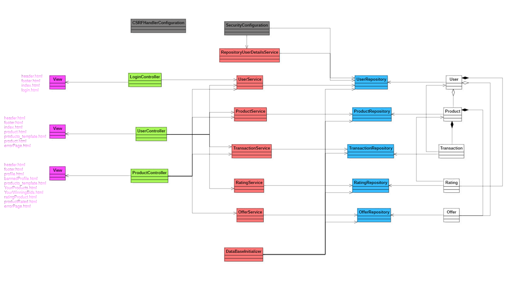

# webapp08
# Aplicación web de subastas "PujaHoy"
## Integrantes
### Jorge Andrés Echevarría j.andres.2022@alumnos.urjc.es jae9104
### Arturo Enrique Gutierrez Mirandona ae.gutierrez.2022@alumnos.urjc.es arturox2500
### Iván Gutiérrez González i.gutierrez.2022@alumnos.urjc.es IvanGutierrrez
### Víctor Bartolomé Letosa v.bartolome.2022@alumnos.urjc.es victorino2324
### Miguel Pradillo Bartolomé	m.pradillo.2020@alumnos.urjc.es	MikePradiBart
## Aspectos principales
### Entidades:
#### Usuario
Guarda el rol, el id y si es usuario registrado guardará su reputación, su método de pago y sus productos públicados.
#### Producto
Guarda todas las ofertas que se realizan sobre el, la transacción final, la hora inicial y final, el precio inicial, los datos del producto (imagen, nombre, etc) y el estado de este (sin verificar, verificado, terminado y vetado).
#### Oferta
Guardará el precio de la puja, la hora a la que se realiza, el usuario que la efectua y el identificador del producto.
#### Transacción
Guarda el precio final, el usuario que vende el producto y el que lo compra y el identificador del producto.
### Tipos de Usuarios:
#### Usuario no registrado
Visualiza los productos, los perfiles de usuarios y el historial de las ofertas.
#### Usuario registrado
Puede publicar productos para subasta, hacer ofertas, realizar transacciones (compra o venta) y valorar a otros usuarios.
#### Administrador
Valida productos y banear o desbanear usuarios y productos.
### Permisos de los usuarios:
Los usuarios registrados pueden ver sus productos publicados (vendidos o no), sus datos personales, los productos sobre los que ha realizado una o varias ofertas y ver el precio de estas.
Y los administradores tendrán acceso a los productos publicados y a las ofertas realizadas de todos los usuarios registrados.
### Imágenes:
Los usuarios pueden subir una o varias imágenes sobre los productos que publican.
### Gráficos:
Los usuarios podrán consultar los gráficos que muestran el historial de ofertas de cada producto publicado.
### Tecnología complementaria:
La aplicación web utilizará Auth0 para la gestión de autentificación y autorización.
### Algoritmo o consulta avanzada:
Al ver los productos publicados se mostrarán en orden según la valoración que tenga el usuario que lo publica.
## Diagrama de la base de datos de la aplicación

## Imagenes
A continuación explicaremos las páginas de nuestra web, en caso de ser necesario, según el tipo de usuario que acceda a ellas. En todas las páginas en caso de ser un usuario no registrado el boton de My Account se sustituíria por el de Log in para registrarse.
### Imagen index

### Imagen Store

### Imagen Product
En está pagina saldrán unos botones u otros según quien acceda a ella:

Usuario no registrado: solo le saldrá el botón de "Seller" para ir a al perfil del vendedor.

Usuario registrado que posee el producto: le saldrá la opción de eliminarlo con el botón "Delete".

Usuario registrado que quiere comprar: Le saldrá el botón "Place a bid" para hacer una oferta y el botón "Seller" antes mencionado.

Administrador: Tendrá acceso a los botones "Seller" y "Delete".

Y como aclaración las Reviews mostradás son del perfil del usuario, realizadas por aquellos usuarios que hayan comprado productos suyos en alguna ocasión.

### Imagen Login

### Imagen Profile
En la pagina del perfil se mostra´ra más o menos información y se podrán realizar ciertas acciones según tipo de usuario:

Usuario no registrado: solo podrá ver la información de "Full Name", "User" y "User Rating" y no podrá realizar ninguna acción.

Usuario registrado que accede a su propia cuenta: podrá ver toda la información y tendrá acceso a todas las funciones menos la del botón "Ban User".

Usuario registrado que accede a la cuenta de otro usuario: tendrá el mismo acceso que un usuario no registrado más información de contacto como "Email" y/o "Phone".

Administrador: Tendrá acceso a todos los datos y solo al botón de "Ban User" y "Your Auctions" para banear al usuario o eliminar alguno de sus productos.

### Imagen New Auction

### Imagen Edit Profile

### Imagen Your Winning Bids y Imagen Your products
Está página se divirá en dos, según la acción que realize el usuario registrado en su perfil, ya sea ver sus apuestas ganadas  o sus productos publicados (está página también la podrá ver un admionistrador) mostrando el botón de "Rate" y "Eliminate" respectivamente.

### Diagrama de navegación

Aclaraciones:

Flechas amarillas = todos los usuarios.

Flechas verdes = administradores y usuarios registrados quie acceden a su perfil.

Flechas azules = usuarios registrados ajenos a la perfil.

---

---

# Auction Application (PUJAHOY)

# Index

1. **[Auction Application Entities](#auction-application-entities)**
   - [User Entity](#user-entity)
   - [Product Entity](#product-entity)
   - [Offer Entity](#offer-entity)
   - [Transaction Entity](#transaction-entity)
   - [Rating Entity](#rating-entity)

2. **[User Roles & Permissions](#user-roles--permissions)**
   - [Unregistered User](#unregistered-user)
   - [Registered User](#registered-user)
   - [Administrator](#administrator)

3. **[Images](#images)**

4. **[Charts](#charts)**

5. **[Complementary Technology](#complementary-technology)**

6. **[Advanced Algorithm or Query](#advanced-algorithm-or-query)**

7. **[Pages](#pages)**
   - [Featured Products (Index)](#featured-products-index)
   - [Sign-Up Page](#sign-up-page)
   - [Log-In Page](#log-in-page)
   - [Account Details Page](#account-details-page)
   - [Your Winning Bids](#your-winning-bids)
   - [Your Products](#your-products)
   - [Edit Profile](#edit-profile)
   - [New Auction Page](#new-auction-page)
   - [Product Page](#product-page)

8. **[Instructions to Run](#instructions-to-run)**
   - [Required Technologies / Applications](#required-technologies--applications)
   - [Steps](#steps)

9. **[Documentation](#documentation)**
   - [Diagram with the database entities](#diagram-with-the-database-entities)
   - [Class and Templates Diagram](#class-and-templates-diagram)

10. **[Contributors](#contributors)**
    - [Jorge Andrés Echevarría](#jorge-andrés-echevarría)
    - [Arturo Enrique Gutierrez Mirandona](#arturo-enrique-gutierrez-mirandona)
    - [Iván Gutierrez González](#iván-gutierrez-gonzález)
    - [Victor Bartolomé Letosa](#victor-bartolomé-letosa)
    - [Miguel Pradillo Bartolomé](#miguel-pradillo-bartolomé)
    

## Auction Application Entities  

### User Entity  
The User entity represents a person registered in the auction application. It includes attributes such as ID, name, visible name, email, description, encoded password, profile picture, postal code, reputation, and active status.  

### Product Entity  
The Product entity represents an item listed for auction in the system. It includes attributes such as ID, name, description, initial value, seller ID, start time, end time, status, and image.  

### Offer Entity  
The offer entity represents a user's offer for a product in an auction. It includes attributes such as ID, cost, time, product ID, and user ID.  

### Transaction Entity  
The transaction entity represents the final transaction in which a user buys a product from a seller in an auction. It includes attributes such as ID, cost, buyer ID, product ID, and seller ID.  

### Rating Entity  
The rating entity represents the ratings given to sellers for their auctioned products. It includes attributes such as ID, score, product ID, and seller ID.  

---

## User Roles & Permissions  

### Unregistered User  
**Can:**  
- View auctioned products.  
- Browse user profiles.  
- View a product's bidding history.  

### Registered User  
**Can:**  
- Access their personal data.  
- View their listed products.  
- List products for auction.  
- Place bids on auctions.  
- Complete transactions as a buyer or seller.  
- View the products they have bid on and won.  
- Rate other users.  

### Administrator  
**Can:**  
- Have access to all listed products.  
- Ban or unban users and products.  
- May also have regular user privileges.  

---

## Images  
- Users can upload images for the products they list.  
- Users may have their own profile picture.  

## Charts  
- Users can view line charts displaying the bidding history for each listed product.  

## Complementary Technology  
- The web application was supposed to use **Auth0** for authentication and authorization management. However, due to issues with the implementation it was decided to take the safer route and implement the map API that shows a postal code area.

## Advanced Algorithm or Query  
- When viewing listed products, they will be displayed in order based on the rating of the seller.  

---

## Pages  

### Featured Products (Index)  
All users, including unregistered ones, can browse available products. These products are displayed in order based on the ratings of the sellers. Users can navigate to individual product pages to view more details.

### Sign-Up Page  
Only available to unregistered users. This page allows them to provide the necessary information to create an account.

### Log-In Page  
Accessible to all users. It allows registered users to enter their credentials and access the application.

### Account Details Page  
Accessible to registered users and admins. Users can:  
- Edit their profile information.  
- View a list of products they have posted.  
- Access a personal section displaying auctions where they have placed the highest bid.

When viewing another user's profile, these personal sections will not be visible.  

### Your Winning Bids  
This page is available to registered users. It displays a list of auctions where the user placed the highest bid, meaning they have won the item.

### Your Products  
Available to registered users. It shows a list of auctions created by the user, whether they are ongoing or finished.  

### Edit Profile  
Users can access this page to update their personal details such as their display name, description, profile picture, and other relevant information. It is an extension to the regular Account Details Page 

### New Auction Page  
Only available to registered users. This page allows them to create new product listings for auction.  

### Product Page  
All users can view:  
- The product's title, initial price, description, and current status (ongoing or finished).  
- The seller’s profile page.  
- A bidding history line chart.  
- An approximate location of the product using the postal code.

Registered users can place bids on the product.  
Admins have the ability to remove product listings to ensure compliance with platform rules.

## Instructions to Run

### Required Technologies / Applications
- VSCode (or any preferred IDE like IntelliJ IDEA or Eclipse)
- Java 21
- Maven 4.0.0 or higher
- Spring Boot 3.4.3
- MySQL Installer 8.0.33 or higher
- MySQL Workbench 8.0.33 or higher

### Steps
- Download the ZIP from this GitHub repository
- Extract it
- Run it with your IDE
- Configure the MySQL database with the password Password0] (specified in application.properties)
- Run the application
- Open your browser
- Go to https://localhost:8443
- If you encounter security warnings, select Advanced options and then Proceed to the website

## Documentation

### Diagram with the database entities

### Class and Templates Diagram 

## Contributors

### Jorge Andrés Echevarría

| Commit | Description |
| :----: | :---------: |
| [1º](https://github.com/CodeURJC-DAW-2024-25/webapp08/commit/fbe449fd97f234ce21aed70ca6b6b1a94b3f74d3) | In this commit full functionality of edit profile was added. Specifically to try new things, the form that sends the data to be replaced in the DB is created dynamically with JS.
| [2º](https://github.com/CodeURJC-DAW-2024-25/webapp08/commit/c0290a3c986e9232818a6ef3c1b77c4c7b1fa86f) | In this commit functionality for register was finished. Backend checks for certain details when registering such as Postal Code. Further checks to these fields were added on commit 1º   |
| [3º](https://github.com/CodeURJC-DAW-2024-25/webapp08/commit/8602f1bc7076d6e5a32ab3d52b2b2e2103c9b836) | In this commit functionality for the Map that locates a seller was implemented. Notice no GoogleMaps was used since a bank account was needed. So we decided to take the free approach. How it works is: Map is loaded with OpenStreetMap (Leaflet.js), the location is obtained with an API, then location is used to pin point in the map|
| [4º](https://github.com/CodeURJC-DAW-2024-25/webapp08/commit/64d703cf32601a1defc8e310f2e2be7856eea541) | In this commit as stated before we tryed to use as external technology the Auth0 login workflow, but due to implementing issues and lack of time idea was depleted and we reversed to an easier approach.|
| [5º](https://github.com/CodeURJC-DAW-2024-25/webapp08/commit/fe3da4a384356c46f69e0f3187c85a660cb53be5) | In this commit logout methods and a first instance of a user session was created. Later on this instance was changed into a more usefull use. Since only 'Authenticated' was sent when a user was logged in accross all views.|

| File | Description |
| :----: | :---------: |
| [1º](https://github.com/CodeURJC-DAW-2024-25/webapp08/blob/main/backend/src/main/java/com/webapp08/pujahoy/security/SecurityConfiguration.java) | I was mostly in charge of security. As stated before all of my time during this weeks was invested into implementing Auth0 but due to a big difficulty when implementing it, because of outdated documentation and lack of information we decided to take the path explained during the theorical classes|
| [2º](https://github.com/CodeURJC-DAW-2024-25/webapp08/blob/main/backend/src/main/java/com/webapp08/pujahoy/controller/UserController.java) | In this Controller i was in charge of making sure editing a profile was possible and all attributes were up to date and as they are intended |
| [3º](https://github.com/CodeURJC-DAW-2024-25/webapp08/blob/main/backend/src/main/java/com/webapp08/pujahoy/controller/LoginController.java) | In the login controller i was in charge of creating the login and register functionalities, despite some help from Iván with the login. |
| [4º](https://github.com/CodeURJC-DAW-2024-25/webapp08/blob/main/backend/src/main/resources/templates/login.html) | The login html was made by me too. Interesting to highlight register and login go throw the same view and are dynamicaly swapped between them with JS. Backend checks are done to secure reliable data.|
| [5º](https://github.com/CodeURJC-DAW-2024-25/webapp08/blob/main/backend/src/main/resources/templates/profile.html) | Although i wasnt in charge of creating the profile view, i had to add edit a profile. As a challenge i decided to use the same view to be able to edit a user with a button. A hidden form is created dynamically and data is sent in it. Backend checks are done to secure reliable data.|

### Arturo Enrique Gutierrez Mirandona 

| Commit | Description |
| :----: | :---------: |
| [1º](https://github.com/CodeURJC-DAW-2024-25/webapp08/commit/31ae760d90eb92d8db777b22bdbe0d39f954f936) | This is my largest commit so far. Due to significant changes in the codebase since my previous commit, I had to restructure all my work to ensure compatibility with the updated codebase.|
| [2º](https://github.com/CodeURJC-DAW-2024-25/webapp08/commit/2f11e58c7ada287219c719031fb6a0078d9d8a52) | The purpose of this commit is to implement a user's view of their own listings. Additionally, I set up the New Product Form. |
| [3º](https://github.com/CodeURJC-DAW-2024-25/webapp08/commit/bf59b4fa5b599bcf96be3105585a7903edabf591) | In this commit, I implemented AJAX functionality to preload products without requiring a page reload. This update also includes a spinner animation. |
| [4º](https://github.com/CodeURJC-DAW-2024-25/webapp08/commit/d24a093708772ac826d11b5768a07cc9cd10b327) | Implemented the bid history line chart using Chart.js. |
| [5º](https://github.com/CodeURJC-DAW-2024-25/webapp08/commit/00a4141413a5d073d5813d7c69f8fe07e553efb7) | Since our template did not include a dedicated profile page, I created one from scratch using Bootstrap and custom CSS. |

| File | Description |
| :----: | :---------: |
| [1º](https://github.com/CodeURJC-DAW-2024-25/webapp08/blob/main/backend/src/main/java/com/webapp08/pujahoy/controller/UserController.java) | I implemented the functionality for creating new auctions and displaying users' listings, as well as the products they have won. |
| [2º](https://github.com/CodeURJC-DAW-2024-25/webapp08/blob/main/backend/src/main/resources/static/js/app.js) | I developed the AJAX functionality using JavaScript. |
| [3º](https://github.com/CodeURJC-DAW-2024-25/webapp08/blob/main/backend/src/main/resources/templates/newAuction.html) | I designed and implemented the HTML structure for the auction creation page, ensuring support for image uploads so that they can later be displayed on product pages. |
| [4º](https://github.com/CodeURJC-DAW-2024-25/webapp08/blob/main/backend/src/main/java/com/webapp08/pujahoy/repository/ProductRepository.java) | I wrote the necessary query to retrieve and display users' winning bids. |
| [5º](https://github.com/CodeURJC-DAW-2024-25/webapp08/blob/main/backend/src/main/resources/templates/profile.html) | At the start of the project, I built the profile page entirely from scratch. |

### Iván Gutierrez González

| Commit | Description |
| :----: | :---------: |
| [1º](https://github.com/CodeURJC-DAW-2024-25/webapp08/commit/4a6a660d4e56250eca70bd25a231ebe3b05ec72d) | Create the server and create, relate, and initialize the initial H2 database.|
| [2º](https://github.com/CodeURJC-DAW-2024-25/webapp08/commit/dacc88a8fc2761cc06c53b235ba3483c6cb2c17a) | Functionality to view the profile of the user and the seller and complete the login functionality that Jorge started.|
| [3º](https://github.com/CodeURJC-DAW-2024-25/webapp08/commit/24c5236fd47da6943f29609ac01374f84b6cfd49) | Functionality to rate the seller, create the form, save the rating, and update the seller's overall rating.|
| [4º](https://github.com/CodeURJC-DAW-2024-25/webapp08/commit/9a0c3c66f6cfe96678f8527e80c1c0117b7a5813) | Functionality for the administrator to ban a registered user and improve the error page structure.|
| [5º](https://github.com/CodeURJC-DAW-2024-25/webapp08/commit/ecd70945c05390cf3927f6980892b80438afce7e) | Create user roles and verify route permissions for each user type.|

| File | Description |
| :----: | :---------: |
| [1º](https://github.com/CodeURJC-DAW-2024-25/webapp08/blob/main/backend/src/main/java/com/webapp08/pujahoy/controller/UserController.java) | Functionalities to view the user's own profile, view the seller's profile, ban users, and rate the seller.|
| [2º](https://github.com/CodeURJC-DAW-2024-25/webapp08/blob/main/backend/src/main/java/com/webapp08/pujahoy/security/SecurityConfiguration.java) | Configure roles, role-specific URLs, login, and cookies to keep the session saved for one day.|
| [3º](https://github.com/CodeURJC-DAW-2024-25/webapp08/blame/main/backend/src/main/resources/templates/profile.html) | Display certain parts using Mustache based on the user type: unregistered user, registered user accessing their own profile, registered user accessing the seller's profile, and administrator.|
| [4º](https://github.com/CodeURJC-DAW-2024-25/webapp08/blob/main/backend/src/main/java/com/webapp08/pujahoy/model/Usuario.java) | Create the class, create and modify the attributes, and implement the constructors, setters, and getters.|
| [5º](https://github.com/CodeURJC-DAW-2024-25/webapp08/blob/main/backend/src/main/java/com/webapp08/pujahoy/service/UserService.java) | Create database queries for users.|

### Victor Bartolomé Letosa

| Commit | Description |
| :----: | :---------: |
| [1º](https://github.com/) | |
| [2º](https://github.com/) | |
| [3º](https://github.com/) | |
| [4º](https://github.com/) | |
| [5º](https://github.com/) | |

| File | Description |
| :----: | :---------: |
| [1º](link del archivo) | |
| [2º](link del archivo) | |
| [3º](link del archivo) | |
| [4º](link del archivo) | |
| [5º](link del archivo) | |

### Miguel Pradillo Bartolomé

| Commit | Description |
| :----: | :---------: |
| [1º](https://github.com/) | |
| [2º](https://github.com/) | |
| [3º](https://github.com/) | CSRFHandlerConfiguration.java Added implementation and full funtionality on this commit for this file |
| [4º](https://github.com/) | |
| [5º](https://github.com/) | |

| File | Description |
| :----: | :---------: |
| [1º](link del archivo) | product.html |
| [2º](link del archivo) | productController.java |
| [3º](link del archivo) CSRFHandlerConfiguration.java | Added implementation and full funtionality on this file as part of the security configuration of the PujaHoy web application. It is responsible for integrating CSRF protection into the application.|
| [4º](link del archivo) | SecurityConfiguration.java |
| [5º](link del archivo) | UserController.java |
